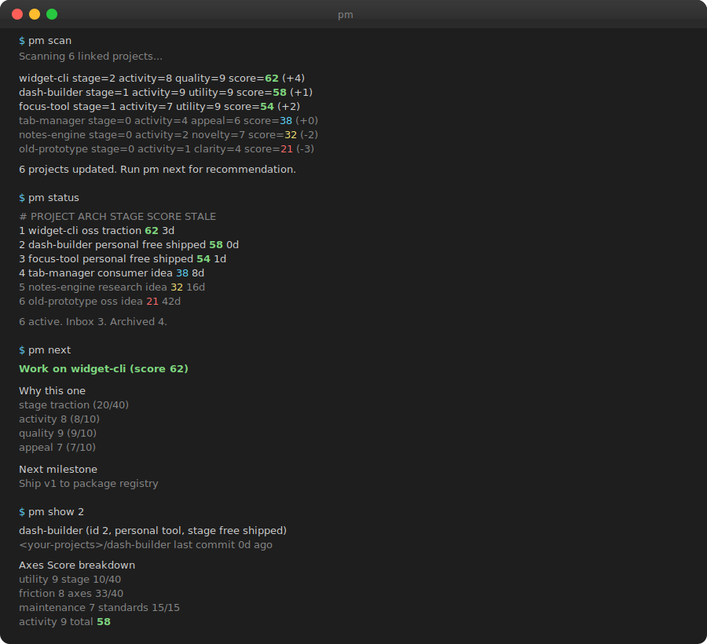

<p align="center">
  
</p>

<h3 align="center">Ranks your projects and tells you what to focus on, fix, or kill</h3>

<p align="center">
  Scans git history, checks project standards, reads roadmap signals.<br>
  Scores each project's health by lifecycle stage and archetype-specific quality axes.
</p>

---

<p align="center">
  
</p>

---

## What it does

Track the repos you care about. `pm` scans git history, checks standards (README, licence, CI, secret scanning), parses roadmap and milestones, and produces a health score for each project. Run `scan` to refresh, `status` to see the ranking, `next` to get a triage recommendation.

Each project has an archetype that determines its quality axes, so an open-source library is judged differently from a research project or a consumer app. Lifecycle stage (idea through to sustainable) captures how far it has progressed.

```
$ pm scan
Scanning 6 linked projects...

  widget-cli        stage=2 activity=8 quality=9   health=62  (+4)
  focus-tool        stage=1 activity=7 utility=9   health=54  (+2)
  dash-builder      stage=1 activity=9 utility=9   health=58  (+1)
  tab-manager       stage=0 activity=4 appeal=6    health=38  (+0)
  notes-engine      stage=0 activity=2 novelty=7   health=32  (-2)
  old-prototype     stage=0 activity=1 clarity=4   health=21  (-3)

6 projects updated. Run pm next for triage.
```

```
$ pm next

  Focus     widget-cli         health=62  traction, strong momentum
  Fix       tab-manager        health=38  no CI, missing licence
  Kill      old-prototype      health=21  stale 42d, no milestones, no momentum
  Kill      notes-engine       health=32  stale 16d, no milestones
```

## Install

```
cargo install --path .
```

Requires Rust 2024 edition (1.85+).

## Quick start

```
pm add "My Project"           # add to inbox
pm link <id> ./path           # link to any codebase, anywhere on disk
pm scan                       # score everything
pm status                     # ranked by health
pm next                       # triage: focus, fix, kill
pm show <id>                  # full detail for one project
```

Projects can live anywhere. `pm link` takes an absolute or relative path, so your codebases do not need to share a parent directory. If you do keep them together, point `pm` at the parent with `PM_ROOT`.

```
export PM_ROOT=/Volumes/work/projects       # any directory tree
pm scan                                     # scans PM_ROOT recursively
```

Without `PM_ROOT`, `pm scan` falls back to `~/projects`. If that folder does not exist, nothing is scanned, which is safe. Linked projects are scored regardless of `PM_ROOT`.

### Web dashboard

```
cd web && npm install && npm run build && cd ..
pm web
# open http://localhost:3141
```

The dashboard mirrors the CLI. Sortable portfolio table, per-project detail with archetype radar, lifecycle stage pills, roadmap readiness, and milestone tracking.

## LLM research

`pm research <id> --score` runs competitive research through a configurable LLM provider and updates the project's axes from the findings. Configure providers in `~/.config/pm/providers.conf`.

```
provider_1=claude
model_1=sonnet
provider_2=codex
```

Supported provider styles out of the box, `claude` and `codex`. Anything else is treated as a generic CLI that takes the prompt as its only argument, with automatic fallback through the list.

## Configuration

Every path `pm` uses is overridable via environment variable, so you can point it at a workspace on an external drive, a separate data directory per machine, or a shared config file.

| Variable | Purpose | Default |
|---|---|---|
| `PM_ROOT` | Root directory to scan recursively | `~/projects` |
| `PM_DATA_DIR` | SQLite database location | `~/.local/share/pm/` |
| `PM_PROVIDERS_CONFIG` | LLM provider config | `~/.config/pm/providers.conf` |
| `PM_PROVIDER_TIMEOUT_SECS` | Fallback timeout | `45` |
| `PM_STANDARDS_CONFIG` | Standards checks config | `~/.config/pm/standards.yml` |

## How it compares

Most project management tools optimise for teams working on one product. `pm` optimises for one person managing many projects.

| Tool | Portfolio level | Auto-scored from code | Open source | Solo-dev focus | Local-first |
|------|----------------|-----------------------|-------------|---------------|-------------|
| Spreadsheets | Yes (manual) | No | Varies | Yes | Yes |
| GitHub Projects | No (per-repo) | No | Free | No | No |
| Linear | No | No | No | No | No |
| Notion | Possible (manual) | No | Free tier | No | No |
| Todoist / TickTick | No | No | Free tier | Yes | No |
| AirFocus / Productboard | Yes | No | No | No | No |
| **`pm`** | **Yes** | **Yes** | **Yes** | **Yes** | **Yes** |

**Where pm is stronger.** The only tool in the list that watches your git activity and produces a health score without you clicking anything. Archetype-aware, a research project does not compete on the same axes as a consumer app. Triage output (focus/fix/kill) gives actionable recommendations, not just a dashboard. LLM-assisted competitive research runs locally through whichever provider you already use. Pairs with [`ward`](https://github.com/michaelmillar/ward) for workspace upkeep.

**Where pm is weaker.** Single-user only, no team features. No time tracking. No Gantt charts. No calendar integration. No mobile client.

**The closest alternative is a spreadsheet.** Many solo developers already keep one. `pm` automates the rows that spreadsheets never do, activity signals, archetype scoring, roadmap readiness, and standards checks.

## How it fits with ward

`ward` optionally reads `pm`'s SQLite database to surface project status when assessing repos to archive. The dependency is one-way, `pm` does not know `ward` exists. Different domain, different usage cadence, `pm` daily, `ward` monthly.

## Status

190 tests covering CLI, store, scoring, DOD parsing, roadmap, standards, research fallback, and duplicate detection.

Not yet implemented.

- Per-archetype radar-comparison view (portfolio radar)
- Calendar integration for milestone deadlines
- Charter diffing across scans
- Mobile read-only view
- GitHub issues as milestone source
- Time tracking per project

## Licence

[Apache 2.0](LICENSE)
