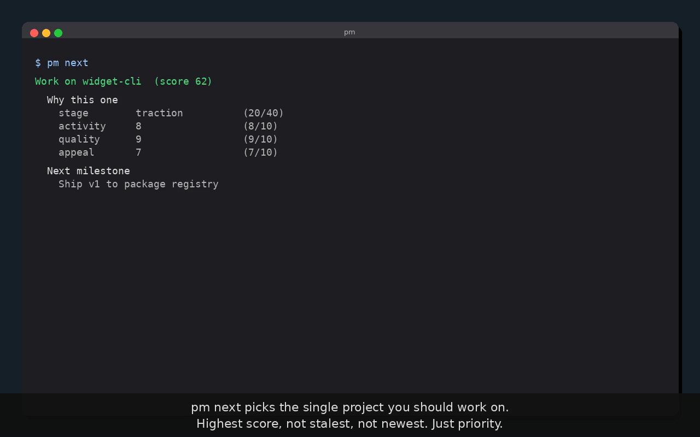

<p align="center">
  
</p>

<h3 align="center">A priority-driven project manager for solo developers</h3>

<p align="center">
  Tracks your whole portfolio. Auto-scores each project from git activity and filesystem signals.<br>
  Tells you what to work on next.
</p>

---

<p align="center">
  <a href="assets/demo.mp4">
    
  </a>
</p>

---

## What it does

`pm` watches the projects you tell it to watch, reads each one's git history, checks its standards (README, licence, CI, gitleaks), parses its roadmap and milestones, and produces a single priority score per project. You run `pm scan` after a coding session to refresh scores, `pm status` to see the ranked portfolio, and `pm next` to get the one project you should work on.

Each project has an archetype that determines its quality axes, an open-source library is scored differently from a research project or a consumer app. On top of the archetype axes sits a universal lifecycle stage (idea through to sustainable). Priority score is `stage * 10 + mean(axes) * 4`, ranged 0 to 80, so stage and axis quality carry equal weight.

```
$ pm scan
Scanning 6 linked projects...

  widget-cli        stage=2 activity=8 quality=9   score=62  (+4)
  focus-tool        stage=1 activity=7 utility=9   score=54  (+2)
  dash-builder      stage=1 activity=9 utility=9   score=58  (+1)
  tab-manager       stage=0 activity=4 appeal=6    score=38  (+0)
  notes-engine      stage=0 activity=2 novelty=7   score=32  (-2)
  old-prototype     stage=0 activity=1 clarity=4   score=21  (-3)

6 projects updated. Run pm next for recommendation.
```

```
$ pm next
Work on widget-cli  (score 62)

  Why this one
    stage        traction          (20/40)
    activity     8                 (8/10)
    quality      9                 (9/10)
    appeal       7                 (7/10)

  Next milestone
    Ship v1 to package registry
```

## Install

```
cargo install --path .
```

Requires Rust 2024 edition (1.85+).

## Quick start

```
pm add "My Project"           # add to inbox
pm link <id> ./path           # link to any codebase, anywhere on disk
pm scan                       # auto-score everything
pm status                     # ranked list
pm next                       # the one project you should work on
pm show <id>                  # full detail for one project
```

Projects can live anywhere. `pm link` takes an absolute or relative path, so your codebases do not need to share a parent directory. If you do keep them together, point `pm` at the parent with `PM_ROOT`.

```
export PM_ROOT=/Volumes/work/projects       # any directory tree
pm scan                                     # scans PM_ROOT recursively
```

Without `PM_ROOT`, `pm scan` falls back to `~/projects`. If that folder does not exist, nothing is scanned, which is safe. Linked projects are scored regardless of `PM_ROOT`.

### Web dashboard

```
cd web && npm install && npm run build && cd ..
pm serve
# open http://localhost:3000
```

The dashboard mirrors the CLI. Sortable portfolio table, per-project detail with archetype radar, lifecycle stage pills, roadmap readiness, and milestone tracking.

## LLM research

`pm research <id> --score` runs competitive research through a configurable LLM provider and updates the project's axes from the findings. Configure providers in `~/.config/pm/providers.conf`.

```
provider_1=claude
model_1=sonnet
provider_2=codex
```

Supported provider styles out of the box, `claude` and `codex`. Anything else is treated as a generic CLI that takes the prompt as its only argument, with automatic fallback through the list.

## Configuration

Every path `pm` uses is overridable via environment variable, so you can point it at a workspace on an external drive, a separate data directory per machine, or a shared config file.

| Variable | Purpose | Default |
|---|---|---|
| `PM_ROOT` | Root directory to scan recursively | `~/projects` |
| `PM_DATA_DIR` | SQLite database location | `~/.local/share/pm/` |
| `PM_PROVIDERS_CONFIG` | LLM provider config | `~/.config/pm/providers.conf` |
| `PM_PROVIDER_TIMEOUT_SECS` | Fallback timeout | `45` |
| `PM_STANDARDS_CONFIG` | Standards checks config | `~/.config/pm/standards.yml` |

## How it compares

Most project management tools optimise for teams working on one product. `pm` optimises for one person managing many projects.

| Tool | Portfolio level | Auto-scored from code | Open source | Solo-dev focus | Local-first |
|------|----------------|-----------------------|-------------|---------------|-------------|
| Spreadsheets | Yes (manual) | No | Varies | Yes | Yes |
| GitHub Projects | No (per-repo) | No | Free | No | No |
| Linear | No | No | No | No | No |
| Notion | Possible (manual) | No | Free tier | No | No |
| Todoist / TickTick | No | No | Free tier | Yes | No |
| AirFocus / Productboard | Yes | No | No | No | No |
| **`pm`** | **Yes** | **Yes** | **Yes** | **Yes** | **Yes** |

**Where pm is stronger.** The only tool in the list that watches your git activity and computes priority without you clicking anything. Archetype-aware scoring, a research project does not compete on the same axes as a consumer app. LLM-assisted competitive research runs locally through whichever provider you already use. Pairs with [`reap`](https://github.com/michaelmillar/reap) for workspace upkeep.

**Where pm is weaker.** Single-user only, no team features. No time tracking. No Gantt charts. No calendar integration. No mobile client.

**The closest alternative is a spreadsheet.** Many solo developers already keep one. `pm` automates the rows that spreadsheets never do, activity signals, archetype scoring, roadmap readiness, and standards checks.

## How it fits with reap

`reap` optionally reads `pm`'s SQLite database to surface project status when assessing repos to archive. The dependency is one-way, `pm` does not know `reap` exists. Different domain, different usage cadence, `pm` daily, `reap` monthly.

## Status

190 tests covering CLI, store, scoring, DOD parsing, roadmap, standards, research fallback, and duplicate detection.

Not yet implemented.

- Per-archetype radar-comparison view (portfolio radar)
- Calendar integration for milestone deadlines
- Charter diffing across scans
- Mobile read-only view
- GitHub issues as milestone source
- Time tracking per project

## Licence

[Apache 2.0](LICENSE)
